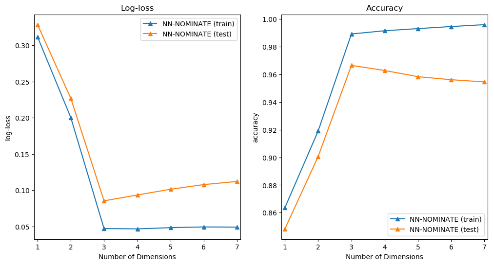
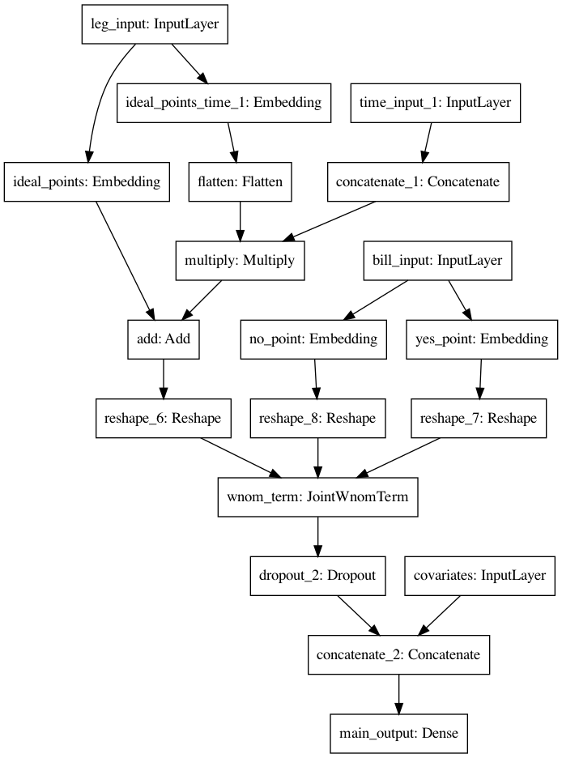

```{r setup, include=FALSE}
# Setup a python instance to use
library(reticulate)
use_condaenv("leg_math")
```

```{python, include=FALSE}
import os
import numpy as np
import pandas as pd

import pickle

from leg_math.keras_helpers import NNnominate
from leg_math.data_processing import process_data

from keras.utils import plot_model

import matplotlib.pyplot as plt
import seaborn as sns

from scipy import stats

DATA_PATH = os.path.expanduser("~/data/leg_math/")

i = 2
data_params = dict(
               data_type="test",
               congress_cutoff=114,
               k_dim=i,
               k_time=0,
               covariates_list=[],
               )
vote_data = process_data(**data_params, return_vote_df=False)
# vote_data, vote_df = process_data(**data_params, return_vote_df=True)
model_params = {
                "n_leg": vote_data["J"],
                "n_votes": vote_data["M"],
                "k_dim": data_params["k_dim"],
                "k_time": data_params["k_time"],
                "init_leg_embedding": vote_data["init_embedding"],
                "yes_point_dropout": 0.0,
                "no_point_dropout": 0.0,
                "combined_dropout": 0.5,
                "dropout_type": "timestep",
                "covariates_list": data_params["covariates_list"],
                }

model = NNnominate(**model_params)

plot_model(model, to_file='model.png')

i = 2
data_params = dict(
               data_type="test",
               congress_cutoff=114,
               k_dim=i,
               k_time=0,
               covariates_list=["in_majority"],
               )
vote_data = process_data(**data_params, return_vote_df=False)
# vote_data, vote_df = process_data(**data_params, return_vote_df=True)
model_params = {
                "n_leg": vote_data["J"],
                "n_votes": vote_data["M"],
                "k_dim": data_params["k_dim"],
                "k_time": data_params["k_time"],
                "init_leg_embedding": vote_data["init_embedding"],
                "yes_point_dropout": 0.0,
                "no_point_dropout": 0.0,
                "combined_dropout": 0.5,
                "dropout_type": "timestep",
                "covariates_list": data_params["covariates_list"],
                }

model = NNnominate(**model_params)

plot_model(model, to_file='model_covariates.png')

i = 2
data_params = dict(
               data_type="test",
               congress_cutoff=114,
               k_dim=i,
               k_time=1,
               covariates_list=["in_majority"],
               )
vote_data = process_data(**data_params, return_vote_df=False)
# vote_data, vote_df = process_data(**data_params, return_vote_df=True)
model_params = {
                "n_leg": vote_data["J"],
                "n_votes": vote_data["M"],
                "k_dim": data_params["k_dim"],
                "k_time": data_params["k_time"],
                "init_leg_embedding": vote_data["init_embedding"],
                "yes_point_dropout": 0.0,
                "no_point_dropout": 0.0,
                "combined_dropout": 0.5,
                "dropout_type": "timestep",
                "covariates_list": data_params["covariates_list"],
                }

model = NNnominate(**model_params)

plot_model(model, to_file='model_dynamic.png')
answer=42
```

```{python, include=FALSE}
top_dim = 8
data_type = "test"

for data_type in ["test", "votes"]:
    final_metrics = pd.read_pickle(DATA_PATH + f"{data_type}_data_metrics.pkl")
    plot_data = final_metrics.set_index(["k_dim", "algorithm", "dataset"]).unstack(level=["algorithm", "dataset"]).unstack().reset_index()
    plot_data = plot_data.rename(columns={"level_0": "metric", 0: "score"})
    plot_data["Model"] = plot_data["algorithm"] + "_" + plot_data["dataset"]
    plot_data["Model"] = plot_data["Model"].map({"nn_train": "NN-NOMINATE (train)",
                                                 "nn_test": ("NN-NOMINATE (test)"),
                                                 "wnominate_train": "WNOMINATE (train)",
                                                 "wnominate_test": "WNOMINATE (test)"})
    fig, (ax1, ax2) = plt.subplots(1, 2, figsize=(12, 6))
    # sns.regplot(x, y, ax=ax1)
    # sns.kdeplot(x, ax=ax2)
    sns.tsplot(data=plot_data[(plot_data["metric"] == "log_loss") & (plot_data["algorithm"] == "nn")],
               time="k_dim", unit="Model", condition="Model", value="score",
               err_style=None, marker="o", ax=ax1)
    ax1.lines[-1].set_marker("^")
    ax1.lines[-2].set_marker("^")
    ax1.legend()
    ax1.set(xlim=(0.9, top_dim - 1 + 0.1), xticks=range(1, top_dim), ylabel="log-loss", xlabel="Number of Dimensions", title="Log-loss")
    sns.tsplot(data=plot_data[(plot_data["metric"] == "accuracy_score") & (plot_data["algorithm"] == "nn")],
               time="k_dim", unit="Model", condition="Model", value="score",
               err_style=None, marker="o", ax=ax2)
    ax2.lines[-1].set_marker("^")
    ax2.lines[-2].set_marker("^")
    ax2.legend()
    ax2.set(xlim=(0.9, top_dim - 1 + 0.1), xticks=range(1, top_dim), ylabel="accuracy", xlabel="Number of Dimensions", title="Accuracy")
    fig
    
    fig.savefig(f"{data_type}_metrics.png", bbox_inches='tight')
    fig.clf()
    
    fig, (ax1, ax2) = plt.subplots(1, 2, figsize=(12, 6))
    # sns.regplot(x, y, ax=ax1)
    # sns.kdeplot(x, ax=ax2)
    sns.tsplot(data=plot_data[(plot_data["metric"] == "log_loss")],
               time="k_dim", unit="Model", condition="Model", value="score",
               err_style=None, marker="o", ax=ax1)
    ax1.lines[-1].set_marker("^")
    ax1.lines[-2].set_marker("^")
    ax1.legend()
    ax1.set(xlim=(0.9, top_dim - 1 + 0.1), xticks=range(1, top_dim), ylabel="log-loss", xlabel="Number of Dimensions", title="Log-loss")
    sns.tsplot(data=plot_data[(plot_data["metric"] == "accuracy_score") ],
               time="k_dim", unit="Model", condition="Model", value="score",
               err_style=None, marker="o", ax=ax2)
    ax2.lines[-1].set_marker("^")
    ax2.lines[-2].set_marker("^")
    ax2.legend()
    ax2.set(xlim=(0.9, top_dim - 1 + 0.1), xticks=range(1, top_dim), ylabel="accuracy", xlabel="Number of Dimensions", title="Accuracy")
    fig
    
    fig.savefig(f"{data_type}_metrics_with_wnom.png", bbox_inches='tight')
    fig.clf()

def corrfunc(x, y, **kws):
        r, _ = stats.pearsonr(x, y)
        ax = plt.gca()
        ax.annotate("r = {:.2f}".format(r), xy=(.9, .1), xycoords=ax.transAxes)

#combined_ideal = pd.read_pickle(DATA_PATH + "test_3_combined_ideal_data.pkl")
#nn_true_plot = sns.pairplot(combined_ideal.filter(regex=r"coord\dD_nn|true_coord"), size=3, diag_kind="kde", plot_kws={'alpha': 0.75}); nn_true_plot.map_lower(corrfunc)
#nn_true_plot.set(xlim=(-1, 1), ylim=(-1, 1))
#fig = nn_true_plot.fig
#fig.savefig(os.path.expanduser("nn_true_plot.png"))
#fig.clf()

#algo_comp_plot = sns.pairplot(combined_ideal.filter(regex=r"coord\dD_"), size=3, diag_kind="kde", plot_kws={'alpha': 0.75}); algo_comp_plot.map_lower(corrfunc)
#algo_comp_plot.set(xlim=(-1, 1), ylim=(-1, 1))
#fig = algo_comp_plot.fig
#fig.savefig(os.path.expanduser("algo_comp_plot.png"))
#fig.clf()

combined_ideal = pd.read_pickle(DATA_PATH + "votes_1_combined_ideal_data.pkl")
votes_com_plot = sns.pairplot(combined_ideal.filter(regex=r"coord\dD_"), size=3, diag_kind="kde", plot_kws={'alpha': 0.75}); votes_com_plot.map_lower(corrfunc)
votes_com_plot.set(xlim=(-1.1, 1.1), ylim=(-1.1, 1.1))
fig = votes_com_plot.fig
fig.savefig(os.path.expanduser("votes_comp_plot.png"))
fig.clf()

metrics_df = pd.read_pickle(DATA_PATH + "votes_1_metrics.pkl")

top_dim = 11
plot_data = metrics_df.set_index(["k_dim", "dataset"]).unstack(level=["dataset"]).unstack().reset_index()
plot_data = plot_data.rename(columns={"level_0": "metric", 0: "score"})
fig, (ax1, ax2) = plt.subplots(1, 2, figsize=(12, 6))
# sns.regplot(x, y, ax=ax1)
# sns.kdeplot(x, ax=ax2)
sns.tsplot(data=plot_data[(plot_data["metric"] == "log_loss")],
           time="k_dim", unit="dataset", condition="dataset", value="score",
           err_style=None, marker="o", ax=ax1)
ax1.set(xlim=(0.9, top_dim - 1 + 0.1), xticks=range(1, top_dim), ylabel="log-loss", xlabel="Number of Dimensions", title="Log-loss")
sns.tsplot(data=plot_data[(plot_data["metric"] == "accuracy_score")],
           time="k_dim", unit="dataset", condition="dataset", value="score",
           err_style=None, marker="o", ax=ax2)
ax2.set(xlim=(0.9, top_dim - 1 + 0.1), xticks=range(1, top_dim), ylabel="accuracy", xlabel="Number of Dimensions", title="Accuracy")
fig

fig.savefig("full_votes_metrics.png", bbox_inches='tight')
fig.clf()


metrics_df = pd.read_pickle(DATA_PATH + "votes_93_metrics.pkl")

top_dim = 11
plot_data = metrics_df.set_index(["k_dim", "dataset"]).unstack(level=["dataset"]).unstack().reset_index()
plot_data = plot_data.rename(columns={"level_0": "metric", 0: "score"})
fig, (ax1, ax2) = plt.subplots(1, 2, figsize=(12, 6))
# sns.regplot(x, y, ax=ax1)
# sns.kdeplot(x, ax=ax2)
sns.tsplot(data=plot_data[(plot_data["metric"] == "log_loss")],
           time="k_dim", unit="dataset", condition="dataset", value="score",
           err_style=None, marker="o", ax=ax1)
ax1.set(xlim=(0.9, top_dim - 1 + 0.1), xticks=range(1, top_dim), ylabel="log-loss", xlabel="Number of Dimensions", title="Log-loss")
sns.tsplot(data=plot_data[(plot_data["metric"] == "accuracy_score")],
           time="k_dim", unit="dataset", condition="dataset", value="score",
           err_style=None, marker="o", ax=ax2)
ax2.set(xlim=(0.9, top_dim - 1 + 0.1), xticks=range(1, top_dim), ylabel="accuracy", xlabel="Number of Dimensions", title="Accuracy")
fig

fig.savefig("93_votes_metrics.png", bbox_inches='tight')
fig.clf()

metrics_df = pd.read_pickle(DATA_PATH + "cosponsor_93_metrics.pkl")

plot_data = metrics_df.set_index(["k_dim", "dataset"]).unstack(level=["dataset"]).unstack().reset_index()
plot_data = plot_data.rename(columns={"level_0": "metric", 0: "score"})
fig, (ax1, ax2) = plt.subplots(1, 2, figsize=(12, 6))
# sns.regplot(x, y, ax=ax1)
# sns.kdeplot(x, ax=ax2)
sns.tsplot(data=plot_data[(plot_data["metric"] == "log_loss")],
           time="k_dim", unit="dataset", condition="dataset", value="score",
           err_style=None, marker="o", ax=ax1)
ax1.set(xlim=(0.9, top_dim - 1 + 0.1), xticks=range(1, top_dim), ylabel="log-loss", xlabel="Number of Dimensions", title="Log-loss")
sns.tsplot(data=plot_data[(plot_data["metric"] == "accuracy_score")],
           time="k_dim", unit="dataset", condition="dataset", value="score",
           err_style=None, marker="o", ax=ax2)
ax2.set(xlim=(0.9, top_dim - 1 + 0.1), xticks=range(1, top_dim), ylabel="accuracy", xlabel="Number of Dimensions", title="Accuracy")
fig

fig.savefig("full_cosponsor_metrics.png", bbox_inches='tight')
fig.clf()
```

# Introduction

We propose a neural network implementation of ideal-point estimation that scales well to large datasets and allows incorporation of additional metadata, which we call NN-NOMINATE. Neural networks are well suited for ideal point models, and the performance benefit, along with distributed computing capabilities, allows application of ideal point estimation to pooled datasets where computation was previously infeasible due to scale. We demonstrate the algorithm on two different datasets, the complete history of US Congressional roll call votes and modern cosponsorship behavior, and compare the results against standard ideal point estimation techniques.

We demonstrate NN-NOMINATE in two ways. First, we jointly estimate ideal points over the pooled set of US Congressional roll call votes from 1789-2018.  Unidimensional ideal points from the neural network implementation are similar to the conventional DW-NOMINATE results.  However, cross validation scores indicate that the data are better explained with more than one dimension. Clustering the multidimensional ideal points yields intuitive temporal and ideological groupings and provides a more nuanced picture of ideological polarization. 

To evaluate algorithmic performance, we test the resulting estimates on both training and test data by holding out a subset of legislators’ votes. This allows us to compare the quality of different model parameterizations and choice of dimensions while still guarding against overfitting. Specifically, we directly compare the performance of NN-NOMINATE to different ideal point parameterizations such as DW-NOMINATE and the conventional Bayesian parameterization.

Second, we take advantage of the fact that many more bills are sponsored than actually come to a vote and estimate an ideal point distribution over a large set of sponsorship and cosponsorship decisions in the 93rd-114th Congresses. Cosponsorship provides a different perspective on legislators’ beliefs, independent of strategic voting or administrative votes of little ideological salience. We treat cosponsorship as a clear endorsement of a bill’s content and assume that a choice not to cosponsor a bill can be interpreted as something less than full support. When compared to traditional ideal points, cosponsorship ideal points show somewhat different trends in polarization and result in a higher number of optimal dimensions.


# Implementing Ideal Points as a Neural Network

This work is inspired by two similar lines of research in political science and computer science. Speaking broadly[^1], political scientists -- from the the seminal work of \cite{poole} and \cite{clinton2004statistical}, and up to and including modern contributions such as \cite{imai2016fast} -- have focused primarily on ideal point estimation as a means to position legislators within the ideology space. That these methods also predict votes is somewhat of an afterthought. On the other hand, computer science implementations largely focus on using an ideal point framework to predict legislator votes, without interpreting the ideal points themselves (for example see \cite{gerrish,kraft}).

[^1]: A complete review of the literature in either field is beyond the scope of this work, and there are, unsurprisingly, some exceptions to this assertion.

Combining the insights of these two fields, we wish to use the prediction-focused framework of computer science to select the most accurate model, which in turn would provide the most informative ideal point estimations for substantive interpretation. We suggest that 1) the model that predicts the best *on a held out sample of votes* provides the most insightful ideal points and 2) there is a clear trade-off between explanatory power and ease of interpretation (for example in the number of dimensions chosen) in all ideal point models that should be made explicit.[^2]

[^2]: We will provide evidence that the optimal number of dimensions for ideal point estimation is larger than the most common one or two. It is perfectly reasonable to choose to rely on two dimensions, but the trade-offs of that choice should be clear.

## Model Frameworks

There are two broad frameworks that have been commonly used for ideal point estimation. Both tie back to spatial voting theory and the idea that a legislator will prefer something that is "near" to them in the ideology space. This ideology space can be parameterized with an aribtrary number of dimensions (denoted with $K$), but in most applications $K$ is set to be 1 or 2.

The first framework, the NOMINATE family, posits that the probability that a legislator votes yes on a bill is given by:
\begin{equation}\label{eq:wnom}
prob(vote=yea) = \Phi\left(u_{ijy} - u_{ijn}\right) = \Phi\left(\beta \left[\exp\left(-\frac{1}{2}\sum_{k=1}^s w_k^2 d_{ijyk}^2 \right) - \exp\left({-\frac{1}{2}\sum_{k=1}^s w_k^2 d_{ijnk}^2 }\right)\right]\right)
\end{equation}\noindent
where $u_{ijy}$ is the utility legislator $i$ receives from voting yes ($y$) on proposal $j$.[^11.] This utility is expressed in terms of the squared distance $d_{ijyk}^2$ between a legislator's ideal point and the "yes" outcome point (and similarly $d_{ijnk}^2$ is the distance between the legislator's ideal point and the "no" outcome point). There are also a set of salience weights $w_k^2$ which allow different dimensions to have more impact on the final voting decision. The function $\Phi$ is commonly a normal or logistic cdf, which makes this model essentially a probit or logit regression over a quantity determined by the ideal points and bill attributes. The parameter $\beta$ represents the signal to noise ratio \citep{wnominate}.  A high value corresponds to votes being largely deterministic, a lower value suggests more randomness. For convenience, we will denote the inner portion of this equation as
\begin{equation}\label{eq:jointwnom}
NOM = \exp\left(-\frac{1}{2}\sum_{k=1}^s w_k^2 d_{ijyk}^2 \right) - \exp\left({-\frac{1}{2}\sum_{k=1}^s w_k^2 d_{ijnk}^2 }\right)
\end{equation}\noindent
as it is will be estimated in its own layer in the neural network.

[^11.]: For simplicity, we are surpressing the time dimension that is often present in these models. However, NN-NOMINATE generalizes to include dynamic ideal points as is discussed later in the paper. See also \cite{carroll2009measuring} for more detail about the background of this model.

The second framework, the item-response family, commonly associated with \cite{clinton2004statistical}, predicts a vote as follows:
\begin{equation}\label{eq:irt}
prob(vote=yea) = \Phi\left(\beta_j \cdot \mathbf{x}_i + \alpha_j\right)
\end{equation}\noindent
where $\mathbf{x}_i$ is a $K$ dimensional vector of ideal points and $\Phi$ can correspond to either a logistic or probit model. The bill level parameter $\beta_j$, sometimes refered to as polarity, is multiplied with the ideal point vector and determines the lean of the bill. The parameter $\alpha_j$, sometimes referred to as popularity, determines a baseline approval rate for a specific proposal.

## The Neural Network

While neural networks have become strongly associated with deep learning and black box prediction generation, they are, in essence, flexible optimization systems fitted using various forms of gradient decent algorithms.[^3] All that is required to estimate an ideal point model using a neural network is to set the network structure to match the underlying framework of the ideal point model. One example can be seen in Figure \ref{fig:model1}, which represents the architecture of a W-NOMINATE model. We will walk through each layer of this example in some detail as a baseline for further exploration.

[^3]: Indeed, while not directly applicable to the models contained here, there are several papers proving that feed forward neural networks can approximate any continuous function \citep{cybenko1989approximation, hornik1991}

```{r echo=FALSE, out.width='75%', fig.cap="\\label{fig:model1}Base Model", fig.align='center'}
knitr::include_graphics('model.png')
```

+ Input layers: The inputs to this model consist of numeric identifiers for both legisators and bills. 

+ Embedding layers: These layers take the numeric identifiers and convert them into continuous parameters, for example mapping a specific legislator to her ideal point vector. In this model there is one ideal point embedding for legislators, and two embeddings for bills, the yes point and the no point, that correspond to numeric values associated with W-NOMINATE style estimation. The ideal point layer is restricted in two ways to make the results match more closely to the W-NOMINATE framework. First, the model includes orthogonality regularization on the ideal points \citep{orthreg1, orthreg2}. This penalizes correlation between ideal point dimensions and ensures that the resulting estimates are orthogonal so that each dimension represents a unique facet of ideology, rather than a slight variant of the same overall single dimension. Ideal point embeddings are also given a maximum norm constraint, which ensures that the norm of the ideal point vector for any legislator lies within the unit hypersphere (a common feature of W-NOMINATE).[^4]

[^4]: Note that the maximum norm constraint does not require that any legislator actually attain a unit norm. This differs somewhat from existing implementations which seem to ensure all dimensions fill the range from [-1, 1]. If this behavior is desired, it can be easily fixed in postprocessing.

+ Reshape layers: Because they are often used for text analysis, by default embedding layers assume that there is a sequence of ids to to transform into the embedding space. Since we have only a single id to embed, these layers drop the dimension associated with the sequence to form a two dimensional tensor.

+ JointWnomTerm layer: The embedded and reshaped data is fed into a custom neural network layer that implements the calculation in \ref{eq:jointwnom}. This includes combining the ideal points, the yes points, the no points, as well as calculating the salience weights $w_k$ for each layer.

+ Dropout layer: Dropout regularization, as proposed by \cite{dropout}, has become an extremely common way of limiting model overfitting, often with the additional benefit of improved behavior during model training. Dropout layers set a proportion of model weights to 0 at random during iterations of the training process. This prevents any single weight dominating the prediction of the algorithm. In this specific instance, the dropout layer operates over the salience weights and sets the weights for any given ideology dimension to 0 for a specific iteration of the optimzation algorithm, relying only upon the other dimensions to make a vote prediction.  In practice, this has resulted in better model performance in terms of observable metrics and by limiting overfitting during the training process.

+ Dense layer: The quantity obtained in the JointWnomTerm layer is then used as an input to a Dense layer, parameterised as a logistic regression (i.e. sigmoid activation and binary_crossentropy loss). This returns an estimate for $\beta$ as well as generating the final prediction.

The data is given as a batch of triples, $(legislator\_id, bill\_id, vote)$. The identifiers are fed into the input layers and subsequently into the embeddings to generate the predictive parameters of the network. The vote itself is used as the outcome value of the final model layer (the logistic parameterized Dense layer).

# Testing the Neural Network Implementation

We demonstrate that the neural network implementation works at least as well as existing methods through two simple tests. The first is to test the model on synthetic data, generated with known parameters, and determine how well the method recovers these known values. The second is to check that the results match the commonly used implementations of W-NOMINATE \citep{wnominate} and item response \citep{pscl} ideal points.

## Recovering Known Ideal Points

The synthetic data is generated to have 3 known dimensions, where the random predictions are generated in the NOMINATE parameterization found in equation \ref{eq:wnom}. To guard against overfitting to specific synthetic votes, we train the model on a subset of the data and test it on 20\% of the synthetic votes as a held out set. This means that a legislator's ideal point is determined only by the votes in the training sample and that a bill's parameters are determined only by the subset of votes on that bill that appear in training. An additional implication of this is that at least some votes on a bill must appear in the training set for the bill to appear in the test set.

There are two primary benefits to using a held out sample. First, relying on an out of sample evaluation set is often used to determine when a neural network has converged while estimating a model. There is little point in continuing to optimize a model where out of sample performance has plateaued and doing so usually results in overfitting. 

Second, performance on a held out sample can be used to make additional decisions about the model structure, including parameterization choices or for evaluating distributional assumptions.[^13] For example, how does making the ideal points dynamic affect the model performance? What is the optimal number of ideal point dimensions? An additional dimension may offer an improvement in out of sample prediction, but it almost always increases in sample performance. An out of sample performance test provides an objective metric to determine the optimal number of dimensions to include.[^5] If a practitioner finds it undesirable to omit votes in this fashion, the model could then be refit on the entire dataset using the model setup that performed best on the test data.

[^13]: A recent paper by \cite{marble2017much} uses a held out set to discuss the predictive power of ideal points in survey data, and in doing so estimate ideal points on Senate votes from the 111th-114th congress using a heldout set and cross-validation. To our knowledge, there have not been other attempts to use this out of sample validation strategy more broadly.

[^5]: It is not as simple as saying that "the model that fits best on test data" is the right answer. In some cases it is preferable to say that this is the first model that attains a near minimum.

<!-- ```{r echo=FALSE, out.width='100%', fig.cap="\\label{fig:testmetrics}Performance metrics on Synthetic Data", fig.align='center'} -->
<!--  -->
<!-- ``` -->

```{r echo=FALSE, out.width='100%', fig.cap="\\label{fig:testmetricswnom}Performance metrics on Synthetic Data with W-NOMINATE", fig.align='center'}

```

Figure \ref{fig:testmetricswnom} shows the model performance of NN-NOMINATE on synthetic data, varying the number of dimensions in the model. For comparison, we also include the same quantities for W-NOMINATE, obtained using the wnominate package in R. We evaluate two metrics, accuracy (whether or not the vote was predicted correctly) and log-loss (a common metric used in classification problems). Log-loss is useful because it provides an idea of how good the probability estimates of a model are, and penalizes over-confident predictions. We see that the log-loss decreases rapidly and is minimized at the optimal number of dimensions on the test data, following which the test log-loss begins to increase. Training accuracy shows similar patterns, attaining best performance on the known optimal number of dimensions. NN-NOMINATE and W-NOMINATE shows the same mechanics over training and test data. It appears that for the synthetic dataset at least, NN-NOMINATE (slightly) outperforms the commonly used WNOMINATE package attaining lower log loss and higher accuracy on this specific test data.

<!-- ```{r echo=FALSE, out.width='100%', fig.cap="\\label{fig:nntrueplot}NN-NOMINATE and \"True\" ideal point comparison", fig.align='center'} -->
<!-- knitr::include_graphics('nn_true_plot.png') -->
<!-- ``` -->

<!-- ```{python, echo=FALSE, results='asis'} -->
<!-- combined_ideal = pd.read_pickle(DATA_PATH + "votes_2_combined_ideal_data.pkl") -->

<!-- import pytablewriter -->
<!-- writer = pytablewriter.MarkdownTableWriter() -->
<!-- writer.from_dataframe(combined_ideal.filter(regex=r"coord\dD_")) -->
<!-- writer.write_table() -->
<!-- ``` -->

```{python, include=FALSE}
combined_ideal = pd.read_pickle(DATA_PATH + "test_3_combined_ideal_data.pkl")
temp_table = combined_ideal.filter(regex=r"coord\dD_|true_coord").corr().round(3)
temp_table = temp_table.loc[temp_table.columns.str.contains(r"coord\dD_"),
                            temp_table.index.str.contains("true_coord")]
```

```{r, echo=FALSE, results='asis'}
knitr::kable(py$temp_table, caption='\\label{tab:corr}Correlations between known and estimated ideal points', longtable=F, format="latex", booktabs=T)
```

```{r, include=F}
kable_export = knitr::kable(py$temp_table, caption='\\label{tab:corr}Correlations between known and estimated ideal points', longtable=F, format="latex", booktabs=T)
kableExtra::kable_as_image(kable_export, filename="correlationtable.png")
```

Additionally, Table \ref{tab:corr} shows correlations between the known ideal points (true_coord1D), estimates from NN-NOMINATE (coord1D_nn), and estimates from W-NOMINATE (coord1D_wnom. The correlation between the first dimension of the true and estimated ideal points is near perfect near perfect across both methods. The correlations in the other dimensions are somewhat smaller, although given that the synthetic data was generated with the first dimension having a higher salience weight than the other two this is understandable. Also, because the model was only fit on 80% of the data in training, some imprecision is expected. An equivalent chart on the full dataset yields stronger correlations across all dimensions.

## Comparisons on real data

```{r echo=FALSE, out.width='100%', fig.cap="\\label{fig:votesmetrics}Model metrics on 110th-115th Senate", fig.align='center'}
knitr::include_graphics('votes_metrics_with_wnom.png')
```

In Figure \ref{fig:votesmetrics}, we show the same model evaluation metrics on real world data from the 110th-115th US Senate, which is roughly the same size as the synthetic test set. In this case there seems to be little evidence that there exists more than one dimension in the test data, as both NN-NOMINATE and WNOMINATE improve very little, if at all, by adding additional dimensions.

<!-- In addition to similar performance metrics, the results of the two methods are strongly correlated (GRIB: make this pairplot once the votes are finished running). -->

```{r echo=FALSE, out.width='75%', fig.cap="\\label{fig:votescompplot}NN-NOMINATE and WNOMINATE estimates comparison on 110th-115th Senates", fig.align='center'}
knitr::include_graphics('votes_comp_plot.png')
```

We can also use simple correlations between the estimated ideal points to make sure that the ideal point space is similar across estimation methods. The unidimensional results are shown in Figure \ref{fig:votescompplot}, which includes the distribution of the ideal points on the diagonal and a scatter plot with correlation on the off-diagonal.[^15] The results are nearly identical, with strong correlations between the two estimation procedures, although there is one outlier in the NN-NOMINATE results. Note that since ideal points are not independently identified, including up to dimension switching and other problems, these results do not match in sign.[^12]  Additionally, it is often the case that NN-NOMINATE results in ideal points that are smaller in maginitude on average than the WNOMINATE package.  

[^15]: The apparent cause of this is the orthogonality regularization and/or the maximum norm constraint which seem to behave oddly when imposed in a single dimension. A fix for this problem is forthcoming.

[^12]: Indeed labels often switch across runs of the same model. The exception is for NN-NOMINATE, which because of initialization choices (we impose initial values for Republicans in the sample on ther right and Democrats on the left), almost always results in the first dimension being the dimension most strongly related to party. Note that the predictive results do not depend on this initialization choice, and that it is merely selected for convenience.

# Results and applications

While it is comforting to know that a new implementation of an existing model returns similar results, NN-NOMINATE is capable of more than the existing implementations. The first is large scale ideal point estimation, for example fitting models on the entire history of the US Congress locally on a laptop.  The second is to demonstrate the extensibility of the framework, where the model can be extended very simply to include covariates as well as more complicated representations of a bill than existing representations.

## Large scale implementation

We examine two large datasets, all of which can be fitted easily on most common computers.[^7] The first is simply the entire history of US rollcalls. Additionally, this model is dynamic, making it similar to the DW-NOMINATE parameterization. A legislators ideal point at time $t$ is decomposed into a linear function of time, $x_{ikt} = x_{ik} + \delta_{ik} t_i$, where $x_{ik}$ is a constant ideal point for legislator $i$ in dimension $k$, $\delta_{ik}$ is a drift parameter for legislator $i$ on dimension $k$, and $t_i$ represents how long a legislator has been serving in congress.[^17] 

[^7]: Neural networks have a reputation as require lots of processing power, including the use of graphics cards. However, for a straightforward model like this, such processing power is not necessary. Formal performance comparisions to existing methods is forthcoming.
<!-- Note that in the case of the WNOMINATE and pscl packages, performance comparisons are impossible because they require computaiton of a roll call matrix that is IxJ which is more than can easily fit in memory (assuming integer values for all votes this still takes up more than XXGB). -->

[^17]: A full exposition of the math math behind the dynamic part of DW-NOMINATE is available in \cite{carroll2009measuring}. NN-NOMINATE is capable of estimating any polynomial function of time, but a linear parameterization matches the traditional DW-NOMINATE choice and adding additional time dimensions make little different to the results. Note that NN-NOMINATE, unlike DW-NOMINATE, does not impose any orthogonality conditions on the polynomials themselves. A diagram of the dynaic NN-NOMINATE is available in \ref{fig:modeldynamic} in the appendix.

```{r echo=FALSE, out.width='100%', fig.cap="\\label{fig:fullvotesmetrics}Metrics on Ideal-Points from the 1st-115th Congresses", fig.align='center'}

```

A similar dimension tradeoff calculation to the above test cases is shown in Figure \ref{fig:fullvotesmetrics}. This shows that over the entire dataset log-loss on the test data decreases until there are at least 8 dimensions; however, the incremental improvement for the last few dimensions is small and does not have a large impact on the accuracy score. There is some evidence that there are more dimensions to conventional 1 or 2 dimensional model as there is a non-negligible improvement to adding the 3rd and 4th dimension.

The second dataset is the set of all cosponsorship decisions from the 93rd-114th US Congresses. This idea goes back at least to \cite{talbert2002setting}[^14], who find that there are more dimensions in cosponsorship decisions than in voting. Since so many voting decisions include strategic concerns, cosponsorhip, a potentially less impactful choice, could allow legislators to espouse a wider variety of policy opinions (and thus require additional dimensions in the modeling process).

[^14]: See also \cite{aleman2009comparing}.

In this case, a "yes" vote is considered to be sponsoring or cosponsoring a bill, whereas everyone who did not is assumed (at least by opportunity cost) to be a "no". Note that this data is much noiser than votes. Since so many bills are introduced that do not proceed in a given session, there are likely many cases where a legislator would have preferred that a bill pass even if they did not have the opportunity to copsonsor it. Because of this, we add additional dropout layers on the bill parameters themselves. This limits the extent to which the model can overfit to noise in the dataset. The results in \ref{fig:fullcosponsorsmetrics} show that there is again some benefit to including additional dimensions beyond the conventional 1 or 2. However, the incremental effect of each individual dimension is rather small beyond 4-5. Examining voting data for the same period (available in \ref{fig:93votesmetrics} in the appendix) shows no clear indication that there are any more dimensions in cosponsorship than in voting.

```{r echo=FALSE, out.width='100%', fig.cap="\\label{fig:fullcosponsorsmetrics}Metrics on Cosponsorship 93rd-115th Congresses", fig.align='center'}
knitr::include_graphics("full_cosponsor_metrics.png")
```

While the above results could be construed as evidence, that there are fewer dimensions in cosponsoring decisions than there are in voting it seems equally plausible, that the model is more easily fitting to noise in the cosponsorship decisions so rapidly that the true policy preference dimensions.

## Including covariates

We also extend the model to include covariates. As an example, it is plausible that a legislator might behave differently while in the party that controls the chamber. One way this might be observerd is that a legislator in the party in power is more likely to vote yes, on average, than someone in the minority party. This could even be the case when the match with their ideal point is very close, but due to party pressure a legislator could deviate from this to some extent. As such we estimate the models from the previous section including a variable indicating that a legislator is in the party in power so that the logistic layer now becomes:
\begin{equation}
prob(vote=yea) = \Phi\left(\beta \left[\exp\left(-\frac{1}{2}\sum_{k=1}^s w_k^2 d_{iyk}^2 \right) - \exp\left({-\frac{1}{2}\sum_{k=1}^s w_k^2 d_{ink}^2 }\right)\right] + \gamma * pip_{ik}\right)
\end{equation}\noindent
where $\gamma$ represents the effect of being in the party in power.[^16] The results show that this factor is positive, as expected, but that the magnitude represents only a very small difference in vote probability. Note that the NN-Nominate framework does not easily lend itself to hypothesis testing. One way to achieve this would be a parametric bootstrap (ala Poole and Rosenthal) but this has not been attempted.[^8]

[^16]: Extending the neural network in this way is relatively straightforward. Prior to the final dense layer, the JointWnomLayer output is concatenated with an additional input layer which becomes another explanatory variable in the final logistic regression layer. A version of this is shown in the appendix, Table \ref{tab:modelcovariates}

[^8]: One intriguing path forward is suggested by \cite{mandt2017stochastic} who show that under certain conditions stochastic gradient decent (as is used in neural networks) can proxy for Bayesian inference.

Additionally, while a discussion of using a text representation of a bill, rather than a simple indicator value, is beyond the scope of this work this is a prime area of current research (for example see \cite{kornilova2018party}). These models work by building embedding representations of the bills themselves and then determining legislators ideal points relative to this more robust representation of a bill. While the accuracy of these models does not yet match that of the bill indicator approach, these models have the strong advantage of allowing out of sample prediction on new bill text. This means that we can determine how a legislator would vote on new bills, as they are introduced (for more we refer you to the \cite{kornilova2018party}).

# Conclusion

We have shown that ideal point estimation is a natural fit for a neural networks and that we can replicate existing parameterizations using this new system. However, we feel that this is only scratching the surface of their potential. We believe that extending this framework, both with ideas mentioned above and others, will yield new and important insights into the legislative process.

<!-- \pagebreak -->

<!-- # References -->
<!-- https://stackoverflow.com/questions/41532707/include-rmd-appendix-after-references -->
<!-- <div id="refs"></div> -->
<div id="refs"></div>

\clearpage

# Appendix
\appendix
```{r echo=FALSE, out.width='75%', fig.cap="\\label{fig:modelcovariates}Base Model Including Covariates", fig.align='center'}

```

```{r echo=FALSE, out.width='100%', fig.cap="\\label{fig:93votesmetrics}Metrics on Ideal-Points from the 93rd-115th Congresses", fig.align='center'}
knitr::include_graphics("93_votes_metrics.png")
```

```{r echo=FALSE, out.width='75%', fig.cap="\\label{fig:modeldynamic}Base Model Including Dynamic Components", fig.align='center'}

```

\clearpage

<!-- 1. I implemented DW-NOMINATE as a neural network -->
<!--     - Why? Because I could! But also because it's a nice platform for this kind of optimization. -->
<!--     - It scales much better than existing implementations -->
<!--     - It's extensible in very interesting ways -->
<!-- 2. All ideal point models are (a bit) overfit. -->
<!--     - At some point the algorithm starts to make marginal improvements to the parameters that don't improve out of sample performance -->
<!--     - Out of sample performance matters much more than in sample (e.g. if we only cared about in sample we'd just add dimensions until we cam predict it perfectly) -->
<!--     - Out of sample performance is a useful metric for evaluating modeling choices (adding another dimension, adding a time component, adding an external variable) -->

<!-- this is inline `r py$answer` and  -->

<!-- ```{r} -->
<!-- py$answer -->
<!-- ``` -->


<!-- 1. How to implement in a neural network -->
<!--     a. Discuss both parameterizations -->
<!--     b. Show convergence plots -->
<!--     c. Discuss out of sample fit as the metrics of importance -->
<!-- 2. A Neural Network implementation works -->
<!--     a. It estimates correctly on synthetic data (accuracy tables for both of these) -->
<!--     b. It matches results from standard libraries (wnominate and pscl) on both synthetic and real data -->
<!--         i. Show both in sample and out of sample accuracy (will require writing a python wrapper to get predictions from the R results) -->
<!-- 3. Results and applications of the neural network implementation -->
<!--     a. What are the optimal number of dimensions? Plot these and discuss tradeoffs -->
<!--     b. Applying the model to cosponsorship -->
<!--     c. Polarization differences -->
<!--         i. Votes models over time (how to do in multiple dimensions?) -->
<!--         ii. Compare between cosponsorship and votes -->

<!-- Dropout in two places: 1. Each dimension to ensure fitting even if first dimensions dominates. 2. On bill embeddings (to not overfit to a specific bill). Why not on legislators? The structure of the dynamic part of the model doesn't allow this easily. -->

<!-- TODO: Rerun votes models with the processing -->
<!-- TODO: Run copsonsor with time component (no additional processing!) -->

<!-- XXXXLisa thinks you should move this paragraph somewhere else. We implement ideal point models in a neural network framework because it is easily extensible and transparent.  Our results suggest that the two dimensional model relied on sacrifices explanatory power in voting decisions. -->
