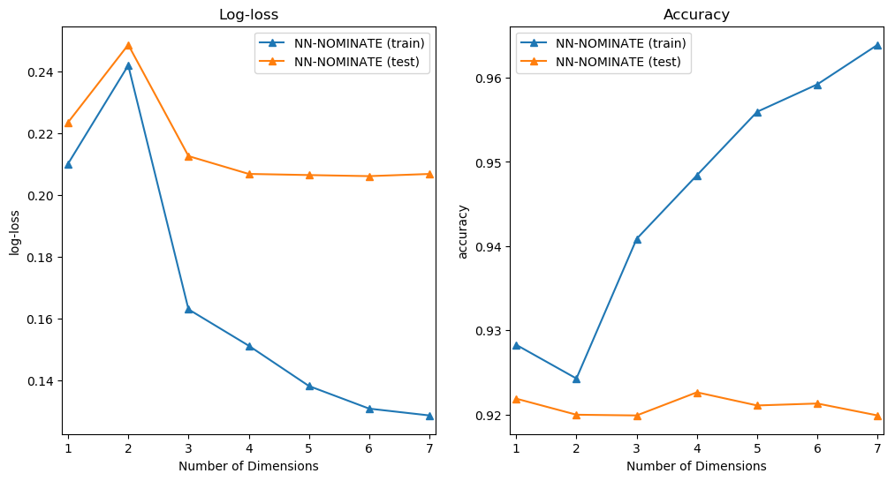

```{r setup, include=FALSE}
# Setup a python instance to use
library(reticulate)
use_condaenv("leg_math")
```

```{python, include=FALSE}
import os
import numpy as np
import pandas as pd

import pickle

from leg_math.keras_helpers import NNnominate
from leg_math.data_processing import process_data

from keras.utils import plot_model

import matplotlib.pyplot as plt
import seaborn as sns

DATA_PATH = os.path.expanduser("~/data/leg_math/")

i = 2
data_params = dict(
               data_type="test",
               congress_cutoff=114,
               k_dim=i,
               k_time=0,
               covariates_list=[],
               )
vote_data = process_data(**data_params, return_vote_df=False)
# vote_data, vote_df = process_data(**data_params, return_vote_df=True)
model_params = {
                "n_leg": vote_data["J"],
                "n_votes": vote_data["M"],
                "k_dim": data_params["k_dim"],
                "k_time": data_params["k_time"],
                "init_leg_embedding": vote_data["init_embedding"],
                "yes_point_dropout": 0.0,
                "no_point_dropout": 0.0,
                "combined_dropout": 0.5,
                "dropout_type": "timestep",
                "covariates_list": data_params["covariates_list"],
                }

model = NNnominate(**model_params)

plot_model(model, to_file='model.png')

answer = '42'
```

```{python, include=FALSE}
top_dim = 8
data_type = "test"

for data_type in ["test", "votes"]:
    final_metrics = pd.read_pickle(DATA_PATH + f"{data_type}_data_metrics.pkl")
    plot_data = final_metrics.set_index(["k_dim", "algorithm", "dataset"]).unstack(level=["algorithm", "dataset"]).unstack().reset_index()
    plot_data = plot_data.rename(columns={"level_0": "metric", 0: "score"})
    plot_data["Model"] = plot_data["algorithm"] + "_" + plot_data["dataset"]
    plot_data["Model"] = plot_data["Model"].map({"nn_train": "NN-NOMINATE (train)",
                                                 "nn_test": ("NN-NOMINATE (test)"),
                                                 "wnominate_train": "WNOMINATE (train)",
                                                 "wnominate_test": "WNOMINATE (test)"})
    fig, (ax1, ax2) = plt.subplots(1, 2, figsize=(12, 6))
    # sns.regplot(x, y, ax=ax1)
    # sns.kdeplot(x, ax=ax2)
    sns.tsplot(data=plot_data[(plot_data["metric"] == "log_loss") & (plot_data["algorithm"] == "nn")],
               time="k_dim", unit="Model", condition="Model", value="score",
               err_style=None, marker="o", ax=ax1)
    ax1.lines[-1].set_marker("^")
    ax1.lines[-2].set_marker("^")
    ax1.legend()
    ax1.set(xlim=(0.9, top_dim - 1 + 0.1), xticks=range(1, top_dim), ylabel="log-loss", xlabel="Number of Dimensions", title="Log-loss")
    sns.tsplot(data=plot_data[(plot_data["metric"] == "accuracy_score") & (plot_data["algorithm"] == "nn")],
               time="k_dim", unit="Model", condition="Model", value="score",
               err_style=None, marker="o", ax=ax2)
    ax2.lines[-1].set_marker("^")
    ax2.lines[-2].set_marker("^")
    ax2.legend()
    ax2.set(xlim=(0.9, top_dim - 1 + 0.1), xticks=range(1, top_dim), ylabel="accuracy", xlabel="Number of Dimensions", title="Accuracy")
    fig
    
    fig.savefig(f"{data_type}_metrics.png", bbox_inches='tight')
    fig.clf()
    
    fig, (ax1, ax2) = plt.subplots(1, 2, figsize=(12, 6))
    # sns.regplot(x, y, ax=ax1)
    # sns.kdeplot(x, ax=ax2)
    sns.tsplot(data=plot_data[(plot_data["metric"] == "log_loss")],
               time="k_dim", unit="Model", condition="Model", value="score",
               err_style=None, marker="o", ax=ax1)
    ax1.lines[-1].set_marker("^")
    ax1.lines[-2].set_marker("^")
    ax1.legend()
    ax1.set(xlim=(0.9, top_dim - 1 + 0.1), xticks=range(1, top_dim), ylabel="log-loss", xlabel="Number of Dimensions", title="Log-loss")
    sns.tsplot(data=plot_data[(plot_data["metric"] == "accuracy_score") ],
               time="k_dim", unit="Model", condition="Model", value="score",
               err_style=None, marker="o", ax=ax2)
    ax2.lines[-1].set_marker("^")
    ax2.lines[-2].set_marker("^")
    ax2.legend()
    ax2.set(xlim=(0.9, top_dim - 1 + 0.1), xticks=range(1, top_dim), ylabel="accuracy", xlabel="Number of Dimensions", title="Accuracy")
    fig
    
    fig.savefig(f"{data_type}_metrics_with_wnom.png", bbox_inches='tight')
    fig.clf()    
```

# Introduction

We propose a neural network implementation of ideal-point estimation that scales well to large datasets and allows incorporation of additional metadata. Neural networks are well-suited for these models, and the performance benefit, along with distributed computing capabilities, allows application of ideal point estimation to pooled datasets where computation was previously infeasible due to scale. We demonstrate the algorithm on two different datasets, the complete history of US Congressional roll call votes and modern cosponsorship networks, and compare the results against standard ideal point estimation techniques.

To evaluate algorithmic performance, we test the resulting estimates on both training and test data by holding out a subset of legislators’ votes. This allows us to compare the quality of different model parameterizations and choice of dimensions while still guarding against overfitting. Specifically, we directly compare the performance of different ideal point parameterizations such as DW-NOMINATE and the conventional Bayesian parameterization. 

We demonstrate the algorithms in two ways. First, we jointly estimate ideal points over the pooled set of US Congressional roll call votes from 1789-2018.  Unidimensional ideal points from the neural network implementation are similar to the conventional DW-NOMINATE results.  However, cross validation scores indicate that the data are better explained with more than one dimension. Clustering the multidimensional ideal points yields intuitive temporal and ideological groupings and provides a more nuanced picture of ideological polarization. 

Second, we take advantage of the fact that many more bills are sponsored than actually come to a vote and estimate an ideal point distribution over a large set of sponsorship and cosponsorship decisions in the 93rd-114th Congresses. Cosponsorship provides a different perspective on legislators’ beliefs, independent of strategic voting or administrative votes of little ideological salience. We treat cosponsorship as a clear endorsement of a bill’s content and assume that a choice not to cosponsor a bill can be interpreted as something less than full support. When compared to traditional ideal points, cosponsorship ideal points show somewhat different trends in polarization and result in a higher number of optimal dimensions.


# Implementing ideal points as a neural network

This work is inspired by two similar lines of research in political science and computer science. Speaking broadly[^1], political scientists--from the days of (really old cite), through Poole and Rosenthal \cite{poole}, and up to and including modern contributions--have focused primarily on ideal point estimation as a means to study the ideology space implied by the ideal points themselves. That these methods also predict votes is somewhat of an afterthought. On the other hand, computer science implementations largely focus on using an ideal point framework to predict legislator votes, without concern regarding the ideal points themselves.

[^1]: A complete review of the literature in either field is beyond the scope of this work, and there are, unsurprisingly, some exceptions to this assertion.

Combining the insights of these two fields, we wish to have the most predictive power without overfitting. We can then interpret the most predictive ideal points for insights.

We suggest that 1. the model that predicts the best *on a held out sample of votes* provides the most insight into ideal points and 2. that there is a clear trade-off between explanatory power and ease of interpretation of ideal point models that should be exploit.[^2]

We implement ideal point models in a neural network framework because it's easily extensible and transparent.  Our results suggest that the two dimensional model relied on sacrifices explanatory power in voting decisions.

[^2]: We will provide evidence that the optimal number of dimensions for ideal point estimation is larger than the most common one or two. It is perfectly reasonable to choose to rely on two dimensions, but the trade-offs of that choice should be clear.

## Model frameworks

There are two broad frameworks that have been commonly used for ideal point estimation. Both tie back to spatial voting theory and the idea that a legislator will prefer something that is "near" to them in the ideology space. This ideology space can be paramterized with an aribtrary number of dimensions (denoted with $K$), but in most applications $K$ is set to be 1 or 2.

The first framework, the NOMINATE family, posits that a the probability that a legislator votes yes on a given bill is given by:
\begin{equation}\label{eq:wnom}
prob(vote=yea) = \Phi\left(u_{ijy} - u_{ijn}\right) = \Phi\left(\beta \left[\exp\left(-\frac{1}{2}\sum_{k=1}^s w_k^2 d_{ijyk}^2 \right) - \exp\left({-\frac{1}{2}\sum_{k=1}^s w_k^2 d_{ijnk}^2 }\right)\right]\right)
\end{equation}\noindent
where $u_{ijy}$ is the utility legislator $i$ receives from voting yes ($y$) on proposal $j$.[^11.] This utility is expressed in terms of the squared distance $d_{ijyk}^2$ between a legislators ideal point and the "yes" outcome point (and similarly $d_{ijnk}^2$ is the distance between the legislator's ideal point and the "no" outcome point). There are also a set of salience weights $w_k^2$ which allow different dimensions to have more impact on the final voting decision. The function $\Phi$ is commonly a normal or logistic cdf, which makes this model, once the weights have been obtained, essentially a probit or logit regression with a single parameter $\beta.$

[^11.]: For simplicity, we are surpressing the time dimension that is often present in these models. However, NN-NOMINATE generalizes to include dynamic ideal points as is discussed later in the paper. See also \cite{carroll2009measuring} for more detail about the background of this model.

There item-response framework, commonly associated with \cite{clinton2004statistical}, the predicts a vote as follows:
\begin{equation}\label{eq:irt}
prob(vote=yea) = \Phi\left(\beta_j \cdot \mathbf{x}_i + \alpha_j\right)
\end{equation}\noindent
where $\mathbf{x}_i$ is a $K$ dimensional vector of ideal points and again $\Phi$ can correspond to either a logistic or probit model. The bill level parameter $\beta_j$, sometimes refered to as polarity, is multiplied with the ideal point vector and determines the lean of the bill. The parameter $\alpha_j$, sometimes referred to as popularity, determine a baseline approval rate for a specific propsal.

## The neural network

While neural networks have become most strongly associated with artificial intelligence, they are, in essence, flexible optimization systems fitted using various forms of gradient decent algorithms.[^3] All that is required to estimate an ideal point model using a neural network is to set the network structure to match the underlying framework of the ideal point model. One example can be seen in Figure \ref{fig:model1}, which represents the architecture of a WNOMINATE model. We will walk through each layer of this example in some detail as a baseline for further exploration.

[^3]: Indeed, while not directly applicable to the models contained here, there are several papers proving that feed forward neural networks can approximate any continuous function \citep(cybenko1989approximation, hornik1991)

```{r echo=FALSE, out.width='75%', fig.cap="\\label{fig:model1}Base Model", fig.align='center'}
knitr::include_graphics('model.png')
```

+ Input layers: The inputs to this model consist of numeric ids for both legisators and bills. The data is given as a batch of triples, $(legislator\_id, bill\_id, vote)$.

+ Embedding layers: These layers take the numeric ids and convert them into continuous measures, for example mapping a specific legislator id to her ideal point. In this model there is one ideal point embedding for legislators, and two embedding for bills, the yes_point and the no point, that correspond to numeric values associated with WNOMINATE style estimation. The ideal point layer is restricted in two ways. First, the model includes orthogonality regularization on the ideal points \citep{orthreg1, orthreg2}. This penalizes correlation between ideal point dimensions and ensures that the resulting estimates are orthogonal. Ideal point embeddings also have a maximum norm constraint, which ensures that the norm of the ideal point vector for any legislator lies within the unit hypersphere.[^4]

[^4]: Note that the maximum norm constraint does not require that any legislator actually attain a unit norm. This differs somewhat from existing implementations which seem to ensure all dimensions fill the range from [-1, 1]. If this behavior is desired, it can be easily fixed in postprocessing.

+ Reshape layers: Because they are often used for text analysis, by default embedding layers assume that there is a sequence of ids to to transform into the embedding space. Since we have only a single id to embed, these layers drop the dimension associated with the sequence to form a two dimensional tensor.

+ JointWnomTerm layer: The embedded and reshaped data is fed into a custom neural network layer that implements the conventional WNOMINATE estimation (cite Poole and Rosenthal and the WNOMINATE package). Specifically, the layer implements the inner portion of model in \ref{eq:wnom}, sepcifically calculating
\begin{equation} \label{eq:jointwnom}
\exp\left(-\frac{1}{2}\sum_{k=1}^s w_k^2 d_{ijyk}^2 \right) - \exp\left({-\frac{1}{2}\sum_{k=1}^s w_k^2 d_{ijnk}^2 }\right)
\end{equation}
where $K$ is the number of dimensions in the model, $w_k$ is the salience weight for dimension $k$, and $d_{iyk}^2$ is the distance between a legislator's ideal point and the yes point of the bill and $d_{ink}^2$ is the distance between the legislator's ideal point and the no point of the bill.[^10]

+ Dropout layer: Dropout regularization, as proposed by \cite{dropout}, has become an extremely common way of limiting model overfitting, often with the additional benefit of improved behavior during model training. Dropout layers set model weights to 0 at random during iterations of the training process. This prevents any single weight dominating the prediction of the algorithm. In this specific instance, the dropout layer sets the salience weight for any given ideology dimension to 0 for a specific iteration of the optimzation algorithm relying upon the other dimensions to make a vote prediction.  In practice, this has resulted in better model performance in terms of observable metrics and by limiting overfitting during the training process..

+ Dense layer: The quantity obtained in the JointWnomLayer is then used as an input to a Dense layer, parameterised as a logistic regression (i.e. sigmoid activation and binary_crossentropy loss). The single model weight estimated here is denoted $\beta$ in most NOMINATE models and represents the signal to noise ratio.  A high value corresponds to votes being largely deterministic, a lower value suggest more randomness.

# The neural network implementation works

We demonstrate that the neural network implementation works at least as well as existing methods through two simple tests. The first is to test the model on synthetic data, generated with known parameters, and determine how well the method recovers these known values. The second is to check that the results match the commonly used implementations of WNOMINATE \citep{wnominate} and item response \citep{pscl} ideal points.

## Recovering known ideal points

The synthetic data is generated to have 3 known dimensions, where the random predictions are generated in the NOMINATE parameterization. To guard against overfitting to specific votes a legislator took, we train the model on a subset of the data and test it on 20\% of votes as a held out set. This means that a legislator's ideal point is determined only by the votes in the training sample and that a bill's paramters are determined only by the subset of legislators included who voted on this bill.

There are two primary benefits to using a held out sample. First, relying on an out of sample evaluation set is often used to determine when a neural network has converged while estimating a model. There is little point in continuing to optimize a model where out of sample performance has plateaued and doing so usually results in overfitting. Second, performance on a held out sample can be used to make additional decisions about the model structure, including parameterization choices or for evaluating distributional assumptions. For example, how does making the ideal points dynamic affect the model performance? What is the optimal number of ideal point dimensions? An additional dimension may offer an improvement in out of sample prediction, but it almost always increases in sample performance. The decision to add a dimension has always been somewhat arbitrary, an out of sample performance test provides an objective metric to evaluate.[^5] 

[^5]: It is not as simple as saying that "the model that fits best on test data" is the right answer. In some cases it is preferable to say, this is the first model that attains a near minimum.


```{r echo=FALSE, out.width='100%', fig.cap="\\label{fig:testmetrics}Performance metrics on Synthetic Data", fig.align='center'}
knitr::include_graphics('test_metrics.png')
```

Figure \ref{fig:testmetrics} shows the model performance of NN-NOMINATE on synthetic data, varying the number of dimensions in the model. We evaluate two metrics, accuracy (whether or not the vote was predicted correctly) and log-loss (a common metric used in classification problems). Log-loss is useful because it provides an idea of how good the probability estimates of a model are, and penalizes over-confident predictions. We see that the log-loss decreases rapidly is minimized at the optimal number of dimensions on the test data, and the test log-loss begins to increase even as in sample . Training accuracy shows similar patterns, attaining best performance on the known optimal number of dimensions.


## Comparison to existing pacakges

```{r echo=FALSE, out.width='100%', fig.cap="\\label{fig:testmetricswnom}Performance metrics on Synthetic Data", fig.align='center'}
knitr::include_graphics('test_metrics_with_wnom.png')
```

Since is has not yet been common to estimate ideal point models on a training and test set we verify that the model works by comparing the results of NNNOMINATE to the WNOMINATE package available in R. The results for the synthetic data are shown in Figure \ref{fig:testmetricswnom}, where WNOMINATE shows similar patterns over training and test data. It appears that for the synthetic dataset at least, NN-NOMINATE (slightly) outperforms the commonly used WNOMINATE package attaining lower log loss and higher accuracy on test data.

We can also use simple correlations between the estimated ideal points to make sure that the ideal point space is similar across estimation methods. These results are shown in Figure \ref{fig:idealcorr} Since ideal points are not independently identified, including up to dimension switching and other problems, there are some important caveats.  First, it is often the case that NN-NOMINATE results in ideal points that are smaller in maginitude on average than the WNOMINATE package and second, dimension labels can switch across the two different methods.[^7]  

```{r echo=FALSE, out.width='100%', fig.cap="\\label{fig:testmetricswnom}Performance metrics on Synthetic Data", fig.align='center'}
knitr::include_graphics('test_metrics_with_wnom.png')
```

[^7]: Indeed labels often switch across runs of the same model. The exception for NN-NOMINATE, which because of initialization choices (we impose initial values for Republicans in the sample on ther right and Democrats on the left), almost always results in the first dimension being the most dimesion most strongly related to party. Note that the predictive results do not depend on this initialization choice, and that it is merely selected for convenience.

## Real vote data

In Table XX, we show the same metrics on real world data from the 110th-115th US Senate. In addition to similar performance metrics, the results of the two methods are strongly correlated.

```{r echo=FALSE, out.width='75%', fig.cap="\\label{fig:votesmetrics}Log-loss on 110th-115th Senate", fig.align='center'}

```

# Results and applications

While it is comforting to know that a new optimization of an existing model returns similar results, NN-NOMINATE is capable of more than the existing implementations. The first is large scale ideal point estimation, for example fitting models on the entire history of the US Congress locally on a laptop.  The second is to demonstrate the extensibility of the framework, where the model can be extended very simply to include covariates as well as more complicated representations of a bill than existing representations.

##

We examine two large datasets, all of which can be fitted locally on a 3 year old mac laptop in less than an hour.[^7] The first is simply the entire history of US rollcalls. The dimension tradeoff calculation from above is shown in Figure XX, which shows that the optimal number of dimensions is at least 8 over this entire dataset.

[^7]: Formal performance comparisions to existing methods is forthcoming. Note that in the case of the WNOMINATE and pscl packages, performance comparisons are impossible because they require computaiton of a roll call matrix that is nXm which is more than can easily fit in memory (assuming integer values for all votes this still takes up more than XXGB).]

The second dataset is the set of all cosponsorship decisions from the 93rd-114th US Congresses, a task that was also attempted in (cite that earlier paper). While that work hypothesized that cosponsorship would show fewer dimesions than voting, we believe that it is also plausible that there should be more. Since so many voting decisions include strategic concerns, cosponsorhip, a potentially less impactful choice, could allow legislators to espouse a wider variety of policy opinions (and thus require additional dimensions in the modeling process).

In this case, a "yes" vote is considered to be sponsoring or cosponsoring a bill, whereas everyone who did not is assumed (at least by opportunity cost) to be a "no". Note that this data is much noiser than votes. Since so many bills are introduced that do not proceed in a given session, there are likely many cases where a legislator would have preferred that a bill pass even if they did not have the opportunity to copsonsor it. Because of this, we add additional dropout layers on the bill parameters themselves. This limits the extent to which the model can overfit to noise in the dataset, although the results in Table XX show that this is only somewhat successful as the training accuracy somewhat rapidly reaches 1.

While the above results could be construed as evidence, as was the assertion made (in that other paper), that there are fewer dimensions in cosponsoring decisions than there are in voting it seems equally plausible that the model is more easily fitting to noise in the cosponsorship decisions so rapidly that the true policy preference dimensions.


##

We also extend the model to include a simple covariate. It is plausible that a legislator might behave differently while in the party that controls the chamber. One way this might be observerd is that a legislator in the party in power is more likely to vote yes, on average, than someone in the minority party. This could even be the case when the match with their ideal point is very close, but due to party pressure a legislator could deviate from this to some extent. As such we estimate the models from the previous section including a variable indicating that a legislator is in the party in power so that the logistic layer now becomes:
\begin{equation}
prob(vote=yea) = \Phi\left(\beta \left[\exp\left(-\frac{1}{2}\sum_{k=1}^s w_k^2 d_{iyk}^2 \right) - \exp\left({-\frac{1}{2}\sum_{k=1}^s w_k^2 d_{ink}^2 }\right)\right] + \gamma * pip_{ik}\right)
\end{equation}
where $\gamma$ represents the effect of being in the party in power. The results show that this factor is positive, as expected, but that the magnitude represents only a very small difference in vote probability. Note that the NN-Nominate framework does not easily lend itself to hypothesis testing. One way to achieve this would be a parametric bootstrap (ala Poole and Rosenthal) but this has not been attempted.[^8]

[^8]: Blei paper about neural networks as Bayesian inference.

Additionally, while a discussion of using a text representation of a bill, rather than a simple indicator value, is beyond the scope of this work this is a prime area of current research (see e.g. Kornilova). These models work by building embedding representations of the bills themselves and then determining legislators ideal points relative to this more robust representation of a bill. While the accuracy of these models does not yet match that of the bill indicator approach, these models have the strong advantage of allowing out of sample prediction on new bill text. This means that we can determine how a legislator would vote on new bills, as they are introduced (for more we refer you to the Kornilova paper).

# Conclusion

1. I implemented DW-NOMINATE as a neural network
    - Why? Because I could! But also because it's a nice platform for this kind of optimization.
    - It scales much better than existing implementations
    - It's extensible in very interesting ways
2. All ideal point models are (a bit) overfit.
    - At some point the algorithm starts to make marginal improvements to the parameters that don't improve out of sample performance
    - Out of sample performance matters much more than in sample (e.g. if we only cared about in sample we'd just add dimensions until we cam predict it perfectly)
    - Out of sample performance is a useful metric for evaluating modeling choices (adding another dimension, adding a time component, adding an external variable)

this is inline `r py$answer` and 

```{r}
py$answer
```


1. How to implement in a neural network
    a. Discuss both parameterizations
    b. Show convergence plots
    c. Discuss out of sample fit as the metrics of importance
2. A Neural Network implementation works
    a. It estimates correctly on synthetic data (accuracy tables for both of these)
    b. It matches results from standard libraries (wnominate and pscl) on both synthetic and real data
        i. Show both in sample and out of sample accuracy (will require writing a python wrapper to get predictions from the R results)
3. Results and applications of the neural network implementation
    a. What are the optimal number of dimensions? Plot these and discuss tradeoffs
    b. Applying the model to cosponsorship
    c. Polarization differences
        i. Votes models over time (how to do in multiple dimensions?)
        ii. Compare between cosponsorship and votes

Dropout in two places: 1. Each dimension to ensure fitting even if first dimensions dominates. 2. On bill embeddings (to not overfit to a specific bill). Why not on legislators? The structure of the dynamic part of the model doesn't allow this easily.
